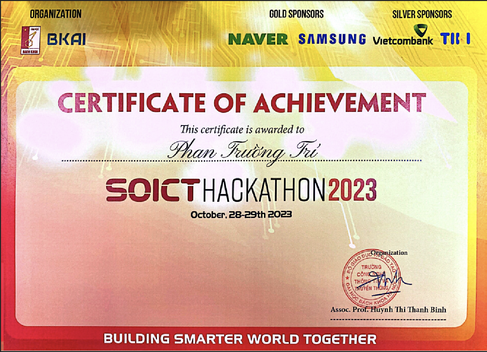

# SOICT Hackathon 2023 - Track Routing Optimization

SoICT Hackathon 2023 is a playground organized by the School of Information and Communication Technology, Hanoi University of Science and Technology, in collaboration with partners. The event seeks to foster a passion for exploring and developing AI techniques and applications to solve real-world problems that benefit daily life and serve the community and society.

There are five different tracks in this contest with total cash prizes amounting to 215 million VND.

# Routing Optimization (TIKI)

The problem is inspired by the famous combinatorial optimization problem called "**Pickup and Delivery with Time Windows**". More specifically, the transport company have **N** deliveries and each of which needs to be picked at a point **P** in a certain time frame and delivered at a point **D** in another certain time frame. Each delivery have its own value for variables such as **P**, **D**, time frames,... Our task is to schedule a plan for **M** vehicle of this company to process as much deliveries as possible, a delivery is called successfully processed if and only if it is picked within its pickup time frame and delivered within its delivery time frame. Beside that, there are other requirements which relate to real work condition to some extent, need to be fulfilled.

# Certificate 
Our team archieved rank 4 overall.

